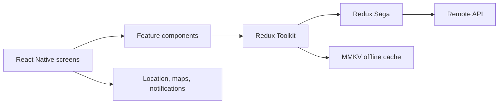

# LocalLoop Mobile Prototype

[](https://github.com/AEVegaEngineer/LocalLoop-App/actions/workflows/test.yml)
[](LICENSE)

An early Expo and React Native foundation for a location-aware local-business application.

This repository currently proves the mobile toolchain, Android native project, reusable component pattern, and automated test setup. The product features described in the roadmap are not yet implemented.

## Implemented

- Expo 53 and React Native 0.79 project
- TypeScript application entry point
- Android native project generated for local builds
- Reusable button component
- Component and application tests with Jest and React Native Testing Library
- GitHub Actions test workflow

## Intended product direction

- Discover nearby businesses and services
- Browse places on a map
- Read and submit opinions
- Store favorites and recently visited places offline
- Receive local notifications
- Coordinate server and cache state with Redux Toolkit and Redux Saga

## Run locally

Requirements:

- Node.js 20
- Expo-supported Android or iOS development environment

```bash
npm ci
npm start
```

Run a native target:

```bash
npm run android
npm run ios
```

## Verification

```bash
npm test -- --runInBand
```

## Architecture direction



The diagram describes the intended architecture, not the current implementation.

## Next milestones

1. Introduce feature-based navigation and typed domain models.
2. Implement a real place-search API boundary.
3. Add MMKV caching with explicit stale-data behavior.
4. Add map and location permission flows.
5. Expand tests around navigation, offline behavior, and failure states.

## License

MIT
